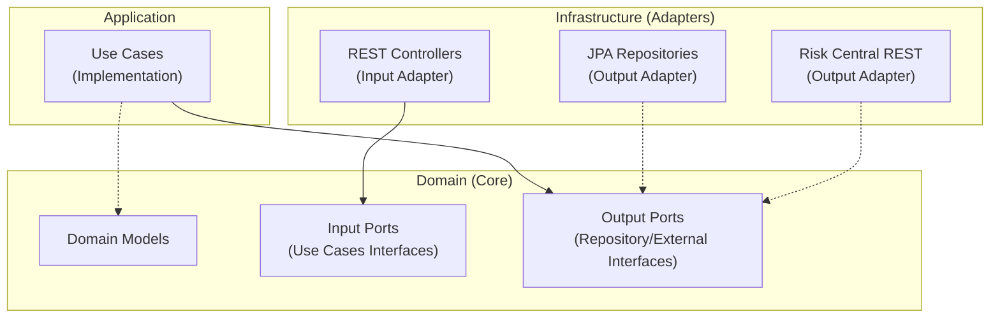

# 🏦 CoopCredit - Comprehensive Credit Application System


A modular and scalable system for automated credit management and evaluation, built with **Hexagonal Architecture**, **Microservices**, and **JWT Security**.

---

## 📋 System Description

CoopCredit modernizes the credit process through two microservices:

1.  **`credit-application-service`**: The core of the system. Manages affiliates, credit applications, security, and business rules.
2.  **`risk-central-mock-service`**: Simulates an external risk bureau, returning consistent scores based on the document number.

### 🚀 Key Features
*   **Pure Hexagonal Architecture**: Domain isolated from frameworks.
*   **Robust Security**: Stateless JWT, BCrypt, and Role-Based Access Control (RBAC).
*   **Automated Evaluation**: Business rule engine (debt-to-income ratio, seniority, risk score).
*   **Advanced Persistence**: JPA, Flyway for migrations, and full transactionality.
*   **Observability**: Metrics with Actuator and Prometheus.
*   **Containerization**: Multi-stage Dockerfiles and Docker Compose.

---

## 🏗️ Hexagonal Architecture

The system strictly follows the Ports and Adapters pattern:



---

## 🛠️ Technologies

*   **Language:** Java 17
*   **Framework:** Spring Boot 3.5.7
*   **Database:** PostgreSQL 15
*   **Security:** Spring Security + JWT
*   **Mapping:** MapStruct
*   **Testing:** JUnit 5, Mockito, Testcontainers
*   **Deployment:** Docker & Docker Compose

---

## 🚀 Execution Instructions

### Prerequisites
*   Docker and Docker Compose installed.
*   Java 17 and Maven (optional, for local execution without Docker).

### Option 1: Docker Execution (Recommended)

1.  **Clone the repository:**
    ```bash
    git clone https://github.com/jesusdavid711/CoopCredit.git
    cd CoopCredit
    ```

2.  **Start the system:**
    ```bash
    docker compose up -d --build
    ```

3.  **Verify services:**
    *   **Credit Service:** `http://localhost:8080/actuator/health`
    *   **Risk Service:** `http://localhost:8081/actuator/health`
    *   **Swagger UI:** `http://localhost:8080/swagger-ui/index.html`

### Option 2: Local Execution

1.  Start a PostgreSQL database.
2.  Configure environment variables in `application.yml` or terminal.
3.  Run services:
    ```bash
    # Terminal 1
    cd risk-central-mock-service && mvn spring-boot:run

    # Terminal 2
    cd credit-application-service && mvn spring-boot:run
    ```

---

## 🔐 Roles and Security

The system implements 3 roles with specific permissions:

| Role | Permissions |
| :--- | :--- |
| **ROLE_ADMIN** | Full access. Can register affiliates and view all applications. |
| **ROLE_ANALISTA** | Can view and manage applications in `PENDING` status. |
| **ROLE_AFILIADO** | Can only view their own applications and data. |

**Test Users (created on startup):**
*   **Admin:** `admin` / `admin123`
*   **Analyst:** `analyst` / `analyst123`
*   **Affiliate:** `affiliate` / `affiliate123`

---

## 📡 Main Endpoints

Full documentation available in **Swagger UI**: `http://localhost:8080/swagger-ui/index.html`

### Authentication
*   `POST /api/auth/register`: Register new user.
*   `POST /api/auth/login`: Get JWT token.

### Affiliates
*   `POST /api/affiliates`: Create affiliate (Admin/Analyst only).
*   `GET /api/affiliates/{id}`: Get detail.

### Applications
*   `POST /api/credit-applications`: Submit credit application.
*   `POST /api/credit-applications/{id}/evaluate`: Evaluate application (triggers risk engine).
*   `GET /api/credit-applications/affiliate/{affiliateId}`: Get applications by affiliate.

---

## 🧪 Testing and Evidence

### Postman Collection
The file `CoopCredit.postman_collection.json` is located in the project root. Import it into Postman to test all flows.

### Credit Evaluation Flow
1.  **Registration:** Affiliate requests credit. Status `PENDING`.
2.  **Evaluation:** System queries `risk-central`.
3.  **Decision:**
    *   ✅ **APPROVED:** If Score > 300, Debt-to-Income < 40%, Seniority > 6 months.
    *   ❌ **REJECTED:** If any rule fails.

### Metrics and Logs
*   **Metrics (Prometheus):** `http://localhost:8080/actuator/prometheus`
*   **Logs:** Structured in console (view with `docker compose logs -f`).

### 📸 Evidence Screenshots

#### 1. Swagger UI
*(Accessing API Documentation)*


#### 2. Postman Success
*(Successful Login and Credit Evaluation)*


#### 3. Docker Containers Running
*(All services healthy)*


---

## 📦 Deliverables

*   ✅ Source Code (GitHub)
*   ✅ Docker Compose
*   ✅ Postman Collection
*   ✅ Documentation (This README)

---
**Developed by:** Jesus David Castro
